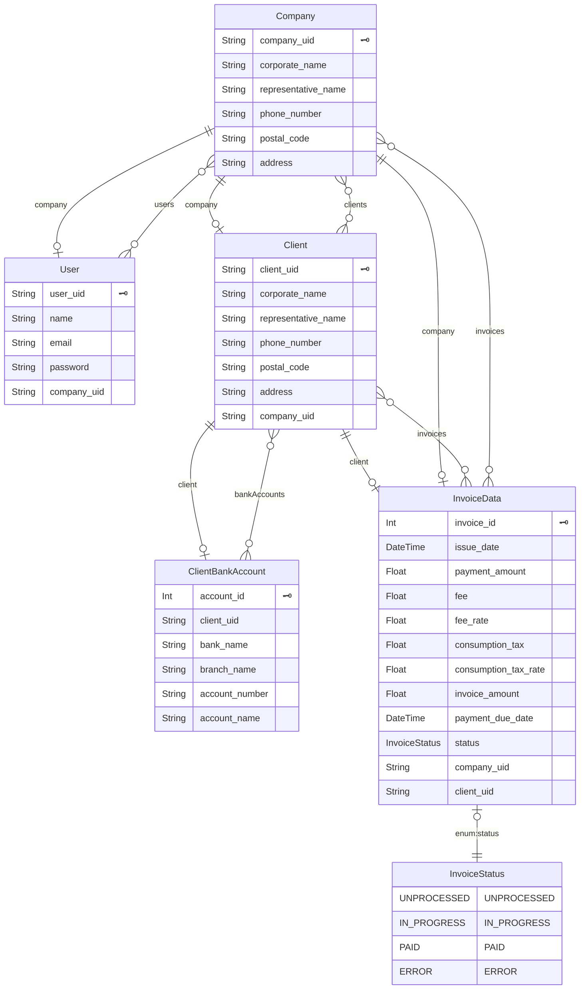

```mermaid
erDiagram

        InvoiceStatus {
            UNPROCESSED UNPROCESSED
IN_PROGRESS IN_PROGRESS
PAID PAID
ERROR ERROR
        }
    
  "Company" {
    String company_uid "🗝️"
    String corporate_name 
    String representative_name 
    String phone_number 
    String postal_code 
    String address 
    }
  

  "User" {
    String user_uid "🗝️"
    String name 
    String email 
    String password 
    String company_uid 
    }
  

  "Client" {
    String client_uid "🗝️"
    String corporate_name 
    String representative_name 
    String phone_number 
    String postal_code 
    String address 
    String company_uid 
    }
  

  "ClientBankAccount" {
    Int account_id "🗝️"
    String client_uid 
    String bank_name 
    String branch_name 
    String account_number 
    String account_name 
    }
  

  "InvoiceData" {
    Int invoice_id "🗝️"
    DateTime issue_date 
    Float payment_amount 
    Float fee 
    Float fee_rate 
    Float consumption_tax 
    Float consumption_tax_rate 
    Float invoice_amount 
    DateTime payment_due_date 
    InvoiceStatus status 
    String company_uid 
    String client_uid 
    }
  
    "Company" o{--}o "User" : "users"
    "Company" o{--}o "Client" : "clients"
    "Company" o{--}o "InvoiceData" : "invoices"
    "User" o|--|| "Company" : "company"
    "Client" o|--|| "Company" : "company"
    "Client" o{--}o "ClientBankAccount" : "bankAccounts"
    "Client" o{--}o "InvoiceData" : "invoices"
    "ClientBankAccount" o|--|| "Client" : "client"
    "InvoiceData" o|--|| "InvoiceStatus" : "enum:status"
    "InvoiceData" o|--|| "Company" : "company"
    "InvoiceData" o|--|| "Client" : "client"
```
